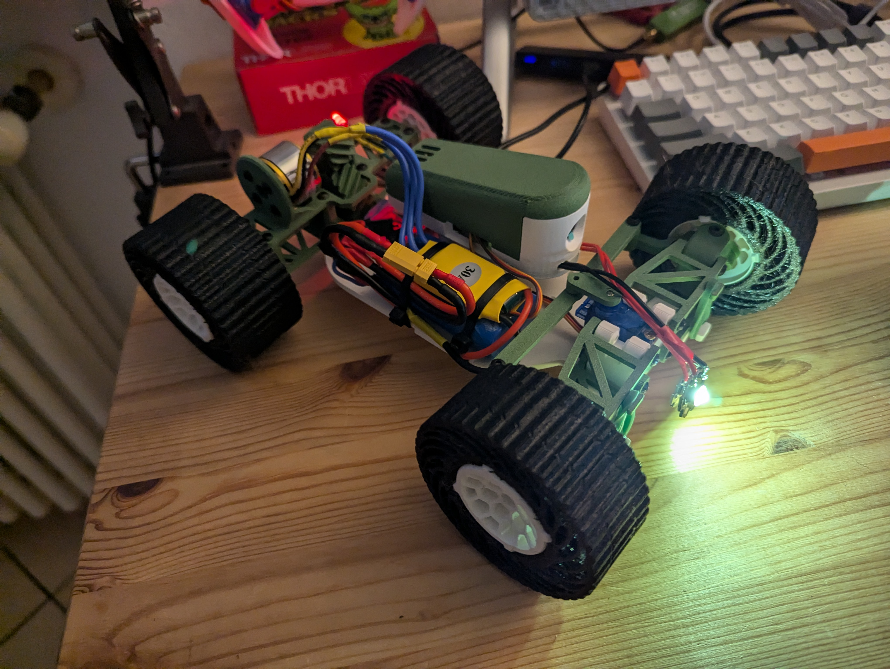

# Project car-ogna
### Amberlab - 2024

This project involves creating a Raspberry Pi-controlled RC car, built for First-Person View (FPV) driving. The car is controlled through a web browser, using either the arrow keys on your PC keyboard or (coming soon) a joystick for enhanced control.

### Electronics and Hardware

The main components include a Raspberry Pi Zero 2 for central control, paired with a brushless motor A2212 and Electronic Speed Controller (ESC) to serve as the car’s engine, and a micro servo motor for steering.

### FPV Vision

For FPV vision, the car is equipped with a Raspberry Pi camera and a USB WiFi adapter (using the Tenda U2, though any compatible adapter can work) or the Pi’s built-in WiFi. 

### Chassis
The car’s chassis is based on the <a href="https://www.thingiverse.com/thing:4233353">Carduino V2</a> with minor adjustments and includes a modified case <a href="https://www.thingiverse.com/thing:1639568"> Pi Zero camera housing</a>, and <a href="https://makerworld.com/it/models/212433?from=search">custom wheels</a>. Everything can be 99% 3D printed, as the only non printed components are M3 screws and four bearrings.

### Power System

Power is provided by 2S Li-ion batteries** with a USB-C charging port built into the car for easy recharging, and a Battery Elimination Circuit (BEC) regulates power for the Raspberry Pi. The car also features bright LED headlights at the front and a red LED at the back for visibility.

## Assembling the car

## Setup of the Raspberry
Once all hardware components are mounted and connected, flash the Raspberry Pi OS onto your SD card, power on the Raspberry Pi, and [SSH into the device](https://www.raspberrypi.com/documentation/computers/remote-access.html#ssh). It is preferrable to use the headless version of Raspbian, as it is lighter and allows a faster stream.

### Step 1: Initial Setup and Updates

After connecting via SSH, run the following commands to ensure the system is updated and upgraded, and install the necessary packages, namely picamera2 and git.

    sudo apt update
    sudo apt upgrade -y
    sudo apt install -y git python3-picamera2 --no-install-recommends

The full update and installation can take a while.

## Step 2: Configure gpiod and Clone the Project Repository

First, ensure `gpiod` starts automatically with the system. Run the following command to enable it:

    sudo systemctl enable pigpiod

Next, clone the Git repository for the car-ogna project to your Raspberry Pi, and reboot the Raspberry for all changes to take effect:

    git clone https://github.com/amberlab-eclettica/car-ogna.git
    sudo reboot

## Step 3: Install USB WiFi Adapter Drivers

For those using USB WiFi adapters, navigate into the project folder:

    cd car-ogna

Then, install the drivers for the USB adapter with the following command:

    sudo dpkg -i driver/AX300-WiFi-Adapter-Linux-Driver-arm.deb
    
also this might take some time.

## Step 4: Launch and Autostart the Interface

To check that everything is working correctly, launch the interface with the following command:

    python interface.py
    
If everything goes well, the server should start, and you will see two columns of numbers on the screen displaying the speed and steering commands of the car, respectively.
To view the FPV stream and control the car, using a web browser navigate to:

    YOURCARNAME.local:8000
    YOURCARIP:8000
    
Once there, you can click on the commands or press the keys on your keyboard to check that the car responds as expected.
If all works well move to step 5, otherwise it's troubleshooting time.

## Step 5: Autostart the Interface

To autostart the interface, you need to create a service file named `interface.service`. Use a text editor to create and edit the file:

    sudo nano /etc/systemd/system/interface.service

Then, add the following content to the file:
    
    [Unit]
    Description=Interface for RC car control
    After=network.target
    
    [Service]
    ExecStart=/usr/bin/python3 /home/USERNAME/car-ogna/interface.py
    WorkingDirectory=/home/USERNAME/car-ogna/
    StandardOutput=inherit
    StandardError=inherit
    Restart=always
    User=USERNAME
    
    [Install]
    WantedBy=multi-user.target

Save the file (CTRL-O) and exit the editor (CTRL-X).

Finally, enable and start the service with the following commands:

    sudo systemctl enable interface.service
    sudo systemctl start interface.service

## Step 5: Set Up a WiFi Hotspot

First, check which WiFi interface your device is using (for example, `wlan1`) with the following command:

    nmcli device

Next, start a hotspot using the following commands:
    
    sudo nmcli con add type wifi ifname wlan1 con-name Hostspot autoconnect yes ssid carogna-hotspot
    sudo nmcli con modify carogna-hotspot 802-11-wireless.mode ap 802-11-wireless.band bg ipv4.method shared
    sudo nmcli con modify carogna-hotspot wifi-sec.key-mgmt wpa-psk
    sudo nmcli con modify carogna-hotspot wifi-sec.psk "PASSWORD"
    sudo nmcli con up carogna-hotspot

This will create a hotspot named "Hostspot" with the specified password.

## Final Remarks

Now you can use your car either by connecting it to an existing network or using the WiFi hotspot. Reboot the car one last time and verify that both the interface and the hotspot are autostarting correctly.

